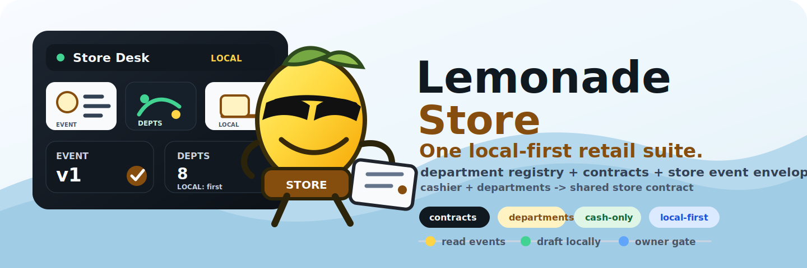

# Lemonade Store

[](https://github.com/bong-water-water-bong/lemonade-store/actions/workflows/ci.yml)
[](https://github.com/bong-water-water-bong/lemonade-store/actions/workflows/docs.yml)
[](pyproject.toml)
[](https://github.com/bong-water-water-bong/lemonade-cashier)
[](#hard-rules)
[](LICENSE)

<p align="center">
  
</p>

> Project/spec home for Lemonade marketplace plugins.

**→ [Project Wiki](docs/wiki/README.md)** — architecture, decisions, gotchas, and agent onboarding.

**Lemonade Store** is the project/spec repo for a family of Lemonade
marketplace plugins. It is not the Lemonade App runtime and it does not
own `lemond`, port `13305`, or any app service lifecycle.

[Lemonade Cashier](https://github.com/bong-water-water-bong/lemonade-cashier)
and the other departments are plugin source repos. They are packaged
separately in the `lemonade-marketplace-plugins` workspace and run as
Podman-isolated marketplace plugins wired through `lemond`.

The first business target is **Tie Dye Farms** (vape / convenience /
soil / tobacco-adjacent, plus a future soil warehouse). The same
suite is designed to be cloned for any ma-and-pa shop.

This repo is **v0.1**: docs and contracts only. No agents, app runtime,
containers, or service launchers are implemented here. Each department
lives in its own repo and becomes a marketplace plugin package through
the separate `lemonade-marketplace-plugins` workspace.

## What's in this repo

```text
lemonade-store/
  AGENTS.md                       # hard rules for every contributor (human or AI)
  README.md                       # you are here
  docs/                           # the spec, plugin boundaries, build order, Cloudflare guide
  examples/tie-dye-farms/         # a working store config + sample event log
  src/lemonade_store/             # tiny contract helpers (events, departments, config)
  tests/                          # contract tests
```

## Hard rules

1. **Cash-only core.** No Stripe / card readers / wallets / payment
   gateways in the core path. Cash, change, receipts, CIT custody, and
   explicit barter records only. Optional outer integrations may exist
   later; they must never be required for a sale to happen.
2. **Owner approval gates public and financial side effects.** Agents
   draft; humans approve.
3. **Cashier is the source of truth for checkout.** Accounting,
   inventory, marketing, and reports *consume* cashier events. They
   never rewrite closed transactions.
4. **Local-first.** Cloud services are allowed for the public website
   only. A daily store close, till reconcile, or inventory read must
   work with no network.
5. **No customer card data. No customer audio. No customer images.**
   The cashier's privacy boundary applies to the whole suite.

The full list is in [`AGENTS.md`](AGENTS.md).

## Departments

| Department | Repo | Owns |
| --- | --- | --- |
| `cashier` | [lemonade-cashier](https://github.com/bong-water-water-bong/lemonade-cashier) | checkout, cash, CIT, receipts, audit/replay, barter records |
| `inventory` | [lemonade-inventory](https://github.com/bong-water-water-bong/lemonade-inventory) | product catalog, SKU aliases, stock counts, categories, soil |
| `accounting` | [lemonade-accounting](https://github.com/bong-water-water-bong/lemonade-accounting) | daily close, cash reconciliation, CIT reconciliation, CSV exports |
| `marketeer` | [lemonade-marketeer](https://github.com/bong-water-water-bong/lemonade-marketeer) | organic post drafts, promotion calendar, website copy drafts |
| `supplier` | [lemonade-supplier](https://github.com/bong-water-water-bong/lemonade-supplier) | supplier catalog, purchase orders, reorder suggestions |
| `reports` | [lemonade-reports](https://github.com/bong-water-water-bong/lemonade-reports) | end-of-day summaries, weekly digest, exceptions |
| `security` | [lemonade-security](https://github.com/bong-water-water-bong/lemonade-security) | local policy checks, agent audits, AIBOM manifests, privacy findings |
| `site` | [lemonade-site](https://github.com/bong-water-water-bong/lemonade-site) | public website, Cloudflare Pages deploy guide |

See [`docs/DEPARTMENTS.md`](docs/DEPARTMENTS.md) for the full contracts.

## Runtime boundary

The actual app is **Lemonade App / Lemonade Server** (`lemond`). It owns:

- `http://127.0.0.1:13305`
- marketplace/plugin discovery
- model/runtime APIs

Department repos do not start the app. `lemonade-store` does not start the
app. All department plugins must be packaged with Podman in the separate
`lemonade-marketplace-plugins` workspace and communicate with `lemond` through
the plugin/marketplace boundary.

## The shared event envelope

Every department emits events of shape `store.event.v1`:

```json
{
  "schema_version": "store.event.v1",
  "event_id": "evt-0001",
  "ts": "2026-05-19T18:30:00Z",
  "store_id": "tie-dye-farms",
  "department": "cashier",
  "type": "cashier.transaction.closed",
  "source": "lemonade-cashier",
  "actor": { "kind": "attendant", "id": "alice" },
  "requires_approval": false,
  "approved_by": null,
  "payload": { "total": "12.34" }
}
```

The envelope is validated by `lemonade_store.events.load_event`. The
full namespace rules and approval semantics live in
[`docs/EVENTS.md`](docs/EVENTS.md).

## Quick start

```sh
make install
make test
```

`make all` runs `lint`, `type`, and `test`. Python 3.11+ is required.
There are no third-party dependencies in the runtime package — only
the dev/docs extras. External agent bridge packages are optional and can
be installed with `make install-agents`.

To load and inspect the Tie Dye Farms example:

```python
from lemonade_store import load_store_config, registry

cfg = load_store_config("examples/tie-dye-farms/store.toml")
print(cfg.business_name, "—", cfg.payment_core, cfg.currency)

for name, dept in registry().items():
    print(name, "->", dept.repo, "emits", dept.emits)
```

## Public website (Cloudflare Pages)

Each store gets a small public website hosted on **Cloudflare Pages**
with DNS on Cloudflare. The website never reads the local store
database directly — only owner-approved content leaves the local
system. See [`docs/CLOUDFLARE_WEBSITE.md`](docs/CLOUDFLARE_WEBSITE.md)
for the step-by-step launch path.

## Status

- v0.1: docs + contracts + Tie Dye Farms example.
- Current reset: departments are plugin source repos only.
- Runtime packaging belongs in `lemonade-marketplace-plugins`.
- All plugins are Podman packages wired through `lemond`.
- See [`docs/BUILD_ORDER.md`](docs/BUILD_ORDER.md) for what comes when.

## License

MIT. See [`LICENSE`](LICENSE).
